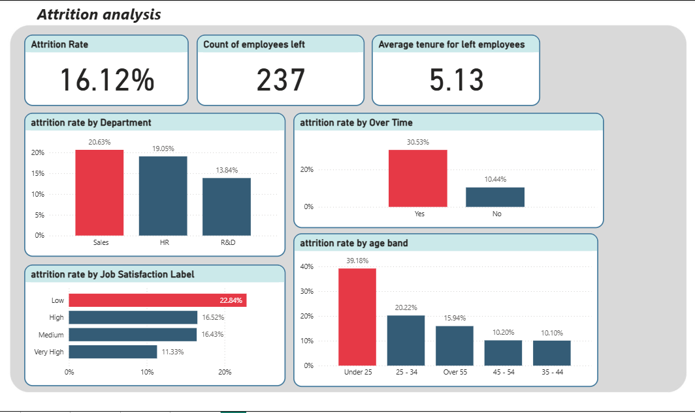
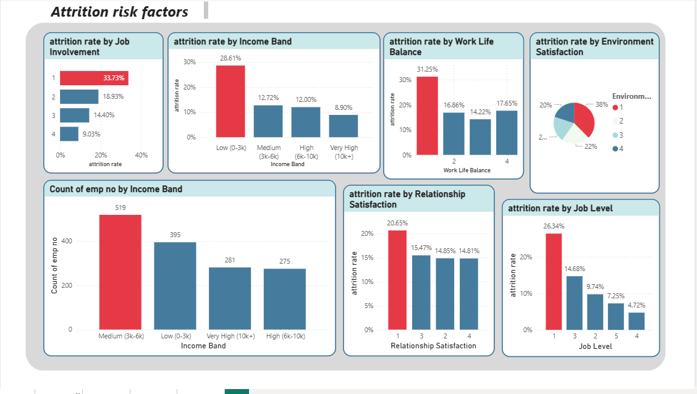
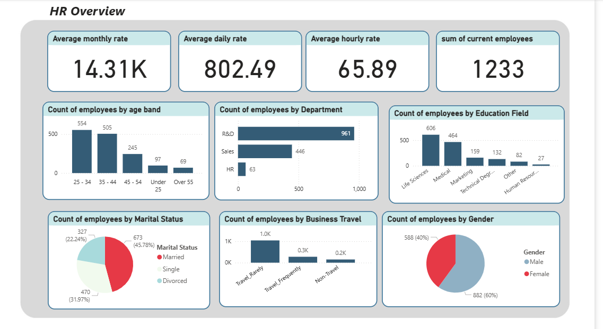
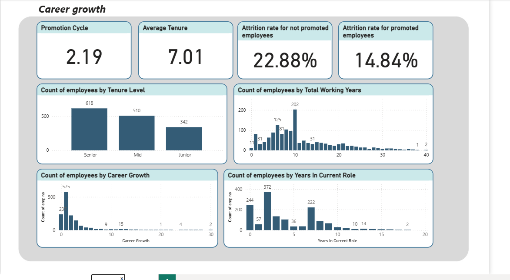
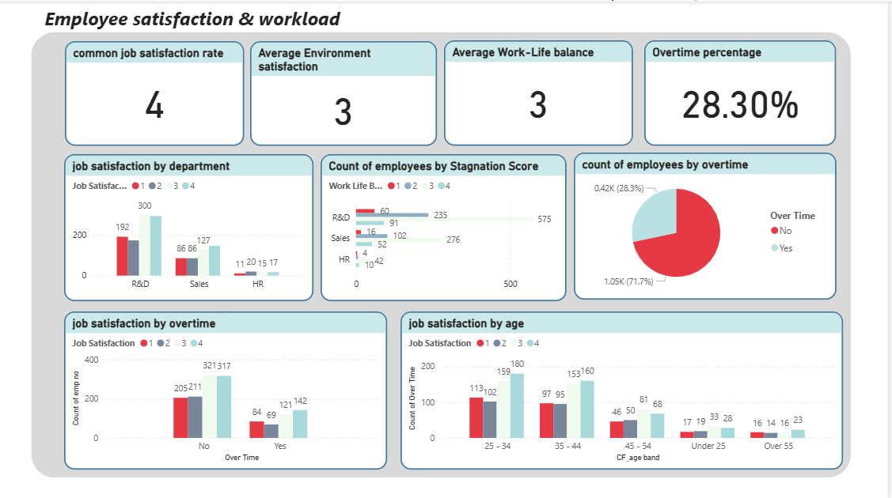

# HR Attrition Analysis 👥

## Project Overview

This project analyzes employee attrition data from a company of 1,470 employees to understand **why employees leave** and what the organization can do to retain talent.

Rather than simply visualizing who left, I focused on identifying the **root causes** behind attrition — questioning whether patterns were department-specific or organization-wide, and whether commonly assumed causes (like lack of promotion) were actually the main drivers.

---

## Business Questions

- What is the overall attrition rate and which departments are most affected?
- Does overtime significantly impact the decision to leave?
- Is low satisfaction a department-specific issue or an organization-wide problem?
- Do employees who are not promoted leave at a higher rate?
- What employee profiles are most at risk of leaving?

---

## Tools Used

- **Power BI** — Data modeling, DAX measures & dashboard visualization
- **Python** — Data exploration & validation

---

## Dataset

- **Source:** IBM HR Analytics Employee Attrition Dataset
- **Size:** 1,470 employees
- **Key Features:** Department, Job Role, Monthly Income, Overtime, Years at Company, Job Satisfaction, Work-Life Balance, Attrition

---

## Key Insights

**1. Sales has the highest attrition rate at 20.63%**
Sales employees leave at a notably higher rate than R&D (13.84%) and HR (19.05%).

**2. Overtime is the strongest attrition driver**
30.53% of employees who work overtime leave, compared to only 10.44% of those who don't — nearly 3x higher. This is the single most impactful factor found in the analysis.

**3. Satisfaction levels are consistent across all departments**
Before concluding that satisfaction issues are department-specific, I checked satisfaction scores across all departments — they were equal. This means attrition is not caused by dissatisfaction in a specific team, but reflects an **organization-wide pattern** that requires a company-level solution, not a department-targeted one.

**4. Young, single employees under 25 are most likely to leave**
With an attrition rate of 39.18%, this group is nearly 2.5x more likely to leave than the company average (16.12%). They are likely early in their careers and exploring options.

**5. Not promoted employees leave at a higher rate — but promotion is not the main driver**
Employees with no career growth have a 22.78% attrition rate vs. 14.84% for promoted employees — an 8% difference. However, only 11% of employees who left had been without a promotion for exactly 2 years, suggesting promotion alone is not the primary reason people leave.

**6. Low income employees are more likely to leave — but they are a small segment**
While low-income employees show higher attrition rates, they represent a small portion of the total workforce. This limits the overall impact but still warrants attention.

---

## Recommendations

**1. Establish acceptable attrition rate benchmarks per department**
Not all attrition is equal — a 20% rate may be acceptable in Sales but concerning in R&D. Define thresholds based on the nature of each department's work before making decisions.

**2. Implement an overtime threshold policy**
No employee should carry overtime for the entire month. Set limits both at the department and individual level — and investigate *what is driving* the need for overtime in the first place, rather than just managing its symptoms.

**3. Take satisfaction indicators seriously as early warning signals**
Since satisfaction is low across all departments equally, this is a cultural and organizational issue. Any initiative to improve satisfaction should be company-wide, not targeted at a single team.

**4. Create development programs for employees under 25**
This group is at the start of their careers and needs structured guidance, mentorship, and visible career paths to feel engaged and committed.

**5. Review compensation for low-income employees**
Understand why these employees are on lower salaries. Gather exit feedback from those who left — this data could reveal whether compensation is a deciding factor and help design retention incentives.

**6. Define a clear and transparent promotion framework**
Employees need to see a clear path to promotion so they feel their efforts are recognized. Ambiguity around promotion criteria increases the likelihood of disengagement and departure.

---

## Dashboard Preview

**Pages:**
- Attrition Analysis
- Employee Overview
- Career Growth
- Employee Satisfaction & Workload
- Attrition Risk Factors

---

## Author

**Marian Moawed**
[GitHub](https://github.com/MarianMoawed)
